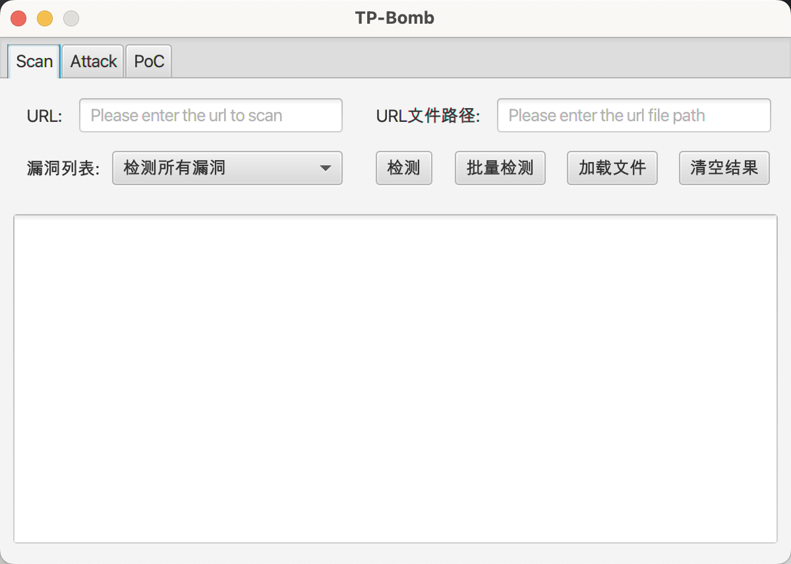
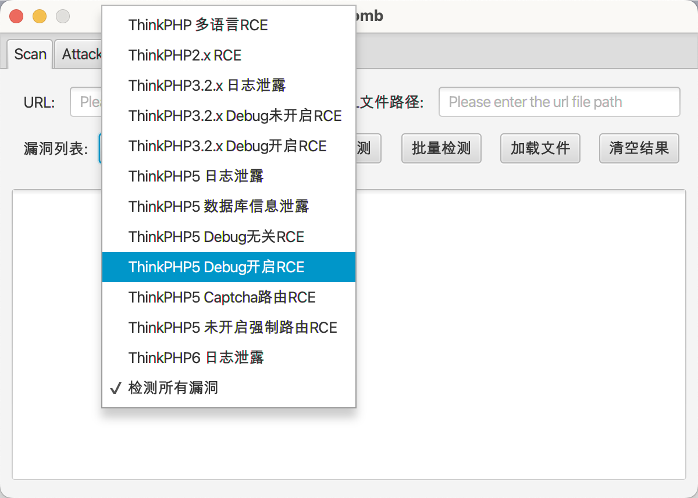
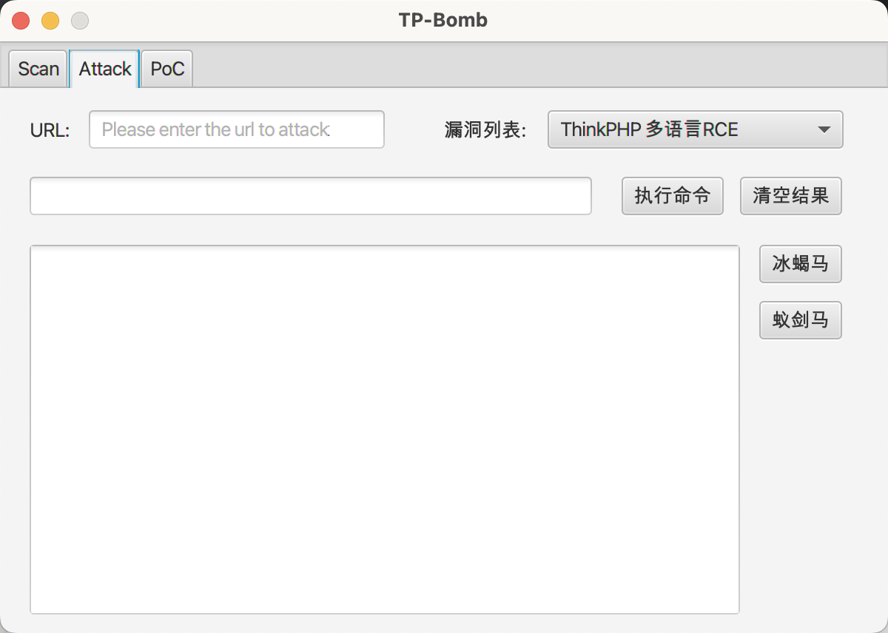
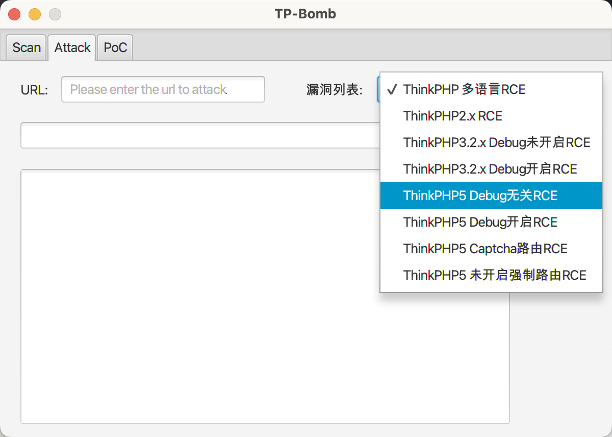
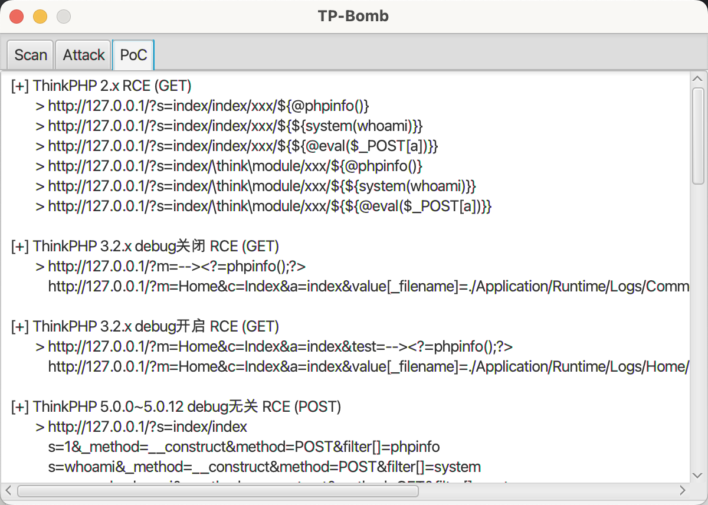

# TP-Bomb
## Introduction

    A ThinkPHP vulnerability detection and utilization tool with a graphical interface. (Used to learn JavaFX practice projects, after writing, I know that there are many places that are like shit, barely usable, although there are few TP vulnerabilities in actual combat at present.)

    一个带有图形界面的ThinkPHP漏洞检测和利用工具。(用来学习JavaFX的实践项目，写完后知道有很多地方像屎一样，勉强可以使用，虽然目前实战中TP漏洞很少)。

## Usage
### Vulnerability Detection Module

    The vulnerability detection module includes the detection of the following vulnerabilities, the accuracy of vulnerability detection cannot be determined due to the lack of real-world testing.

    漏洞检测模块包括对以下漏洞的检测，由于缺乏实际测试，漏洞检测的准确性无法确定。

```java
"ThinkPHP 多语言RCE",
"ThinkPHP2.x RCE",
"ThinkPHP3.2.x 日志泄露",
"ThinkPHP3.2.x Debug未开启RCE",
"ThinkPHP3.2.x Debug开启RCE",
"ThinkPHP5 日志泄露",
"ThinkPHP5 数据库信息泄露",
"ThinkPHP5 Debug无关RCE",
"ThinkPHP5 Debug开启RCE",
"ThinkPHP5 Captcha路由RCE",
"ThinkPHP5 未开启强制路由RCE",
"ThinkPHP6 日志泄露",
```





### Vulnerability Exploitation Module

    The vulnerability exploitation module includes the exploitation of the following vulnerabilities, the injection of antsword-shell and behinder-shell is only effective for ThinkPHP5 related RCE vulnerability, antsword-shell use password tp, behinder-shell use behinder 4.0 above the default-aes protocol and are the default configuration.

    漏洞利用模块包括对以下漏洞的利用，注入蚁剑马和冰蝎马时仅针对ThinkPHP5相关RCE漏洞有效，蚁剑马密码为tp，冰蝎马采用的是冰蝎4.0以上的default aes协议且均为默认配置。

```java
"ThinkPHP 多语言RCE",
"ThinkPHP2.x RCE",
"ThinkPHP3.2.x Debug未开启RCE",
"ThinkPHP3.2.x Debug开启RCE",
"ThinkPHP5 Debug无关RCE",
"ThinkPHP5 Debug开启RCE",
"ThinkPHP5 Captcha路由RCE",
"ThinkPHP5 未开启强制路由RCE"
```






### PoC Module

    The PoC module has a built-in payload of common vulnerabilities in ThinkPHP, which can provide a reference of how to exploit vulnerabilities when part of the vulnerability exploitation module cannot be exploited or when you need to do manual getshell on the vulnerability, which improves the efficiency to a certain extent.

    PoC模块内置了ThinkPHP常见漏洞的payload，当漏洞利用模型部分漏洞无法利用时或者需要对漏洞进行手动getshell时，可以提供漏洞利用方式参考，一定程度上提高了效率



## Display

    Here's a brief demonstration of how to use the tool using a GIF.
    
    下面利用GIF来简略演示了一下如何使用该工具


## 